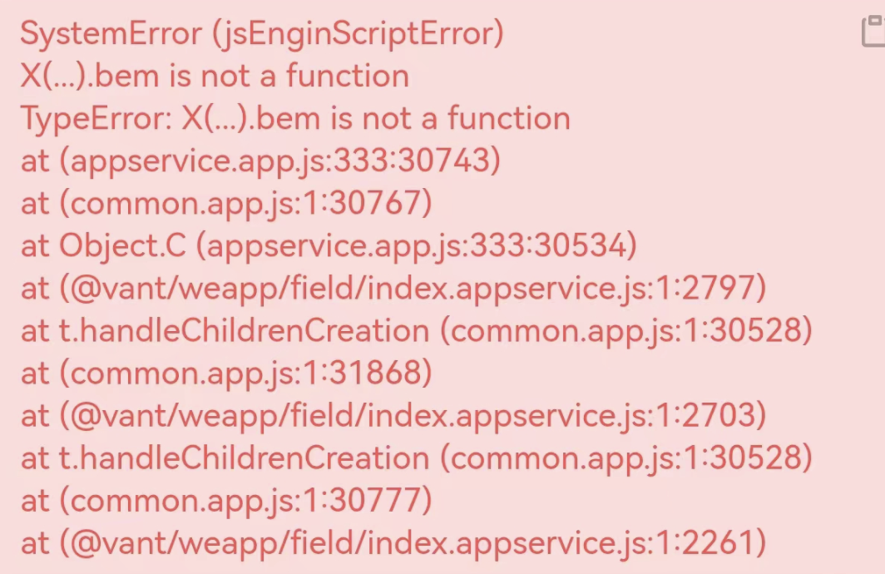
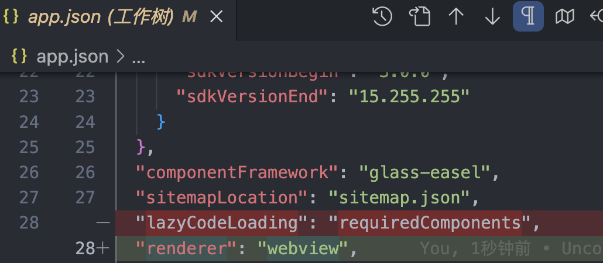

# 2023

# GT

## w

=1109-d4=

### 小程序使用van-field， van-popup组件开发正常显示，预览扫码后却无法显示

**版本**  
小程序版本：3.1.5
"@vant/weapp": "^1.11.1"

**方法**
在app.json 中  
删除 "lazyCodeLoading": "requiredComponents",  
加入 "renderer": "webview",  

最主要是删除lazyCodeLoading 
这个是按需注入