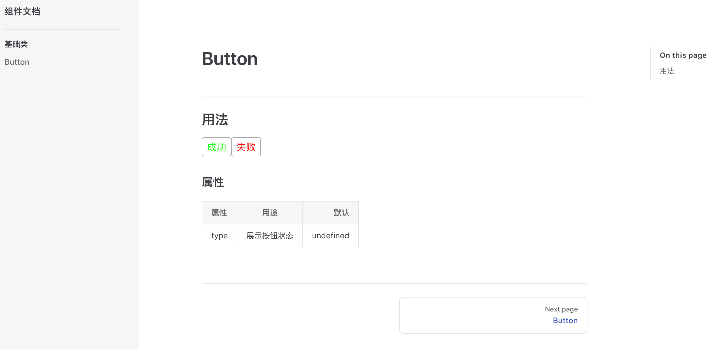

# 2020

## w

=d3--1202=

### 阿里云的云效，第一次拉取代码，会提示输入账号密码

账号是云效的 username ，密码是私人令牌  
第一次拉取没有私人令牌，需要忘记令牌，修改令牌，令牌格式全数字 8 位以上  

# 2021

## w

=d1--0222=

### tip: vue3.x 弃用了 $listeners

1. vue2.x 语法  
   _在 Vue2 中，你可以使用 this.$attrs 和 this.$listeners 分别访问传递给组件的 attribute 和事件监听器。结合 inheritAttrs: false，开发者可以将这些 attribute 和监听器应用到其它元素，而不是根元素：_

```vue
<template>
  <label>
    <input type="text" v-bind="$attrs" v-on="$listeners" />
  </label>
</template>
<script>
export default {
  inheritAttrs: false,
};
</script>
```

2. vue3.x 语法  
   _在 Vue 3 的虚拟 DOM 中，事件监听器现在只是以 on 为前缀的 attribute，这样就成了 $attrs 对象的一部分，因此 $listeners 被移除了。_

```vue
<template>
  <label>
    <input type="text" v-bind="$attrs" />
  </label>
</template>
<script>
export default {
  inheritAttrs: false,
};
</script>
```

=d3-0224=

### tip: nvm 下载

1. 下载地址 <https://github.com/coreybutler/nvm-windows/releases>  
   下载第三个 nvm-setup.zip
   按要求安装

2. 测试 命令行输入 nvm 输出 nvm 相关命令即是成功

3. 配置淘宝镜像  
   nvm 下载 node 版本使用的是外国的服务器 可能会比较慢
   配置方法：
   打开 nvm 的安装目录
   打开 setting.txt
   加入以下内容

```txt
arch: 64
proxy: none
node_mirror: http://npm.taobao.org/mirrors/node/
npm_mirror: https://npm.taobao.org/mirrors/npm/
```

4. 安装 node  
   nvm install 版本号

```cmd
nvm install v14.16.0 | nvm install 14.16.0
```

**tip: 一定要等到下载完再关闭
Installation complete 代表 nodejs 安装完成**

5. 切换 node  
   nvm use 版本号  
   nvm 部分命令

查看已下载 node 版本

```cmd
nvm ls
```

查看当前版本

```cmd
nvm list
```

## w

=d2--0302=

### tip: vue 的 render 函数

```javascript
Vue.component("renderComponent", {
  props: {},
  render: () => {
    return h("div", {}, "12");
  },
});
```

1. h 在 vue 中通常作为 createElement 的别称

   **h 函数：**  
   第一个参数 (String | Object | Function)  
   第二个参数 (Object) 元素的属性  
   第三个参数 (String | Array) 文本内容, 或者是子元素 render 函数组成的数组

如果觉得太麻烦可以使用插件 通过 jsx 语法来书写

2. 下载插件

   ```cmd
   yarn add -D @vue/babel-plugin-jsx
   ```

   在 babel.config.js 配置

   ```javascript
   module.exports = {
     // 这是原来的预设，cli 搭建项目就有的
     presets: ["@vue/cli-plugin-babel/preset"],
     // 需要配置的插件
     plugins: ["@vue/babel-plugin-jsx"],
   };
   ```

3. 编写代码

   ```javascript
   Vue.component('render-component', {
    render() {
      return (
        <div>h1</div>
      )
    }
   })
   // 或者
   components: {
    renderComponent : {
      render() {
        return (
          <div>h1</div>
        )
      }
    }
   }
   ```

构建一个 jsx 文件

```jsx
import { defineComponent, ref } from "vue";

const Demo = defineComponent({
  name: "demo",
  setup(props) {
    const input = ref(null);

    const click = (e) => {
      console.log(e);
      console.log(input.value);
    };
    return {
      click,
      input,
    };
  },
  render() {
    return (
      <>
        <div>test</div>
        <button onClick={this.click}>点击</button>
        <input v-model={this.input} placeholder="啊这" />
      </>
    );
  },
});

export default Demo;
```

使用 defineComponent()，可以获得代码提示

=d4--0304=

### tip: vue-cli4 使用 imports-loader@1.2.0

直接下载的最新版 2.0.0 适用于 webpack5, 使用会报错
可以将 imports-loader 降级

## w

=d2--0309=

### tip: pdfKit 不写 x, y, 文本默认接在上个节点下面

```javascript
doc.text("123", {});
doc.text("345", {});
```

## w

=d5--0319=

### tip: 快速生成数组的方法

```javascript
//实现方法一：循环赋值
var arr1 = new Array(100);
for (var i = 0; i < arr1.length; i++) {
  arr1[i] = i;
}
console.log(arr1);

//实现方法五：
var arr5 = Object.keys(Array.apply(null, { length: 100 })).map(function (item) {
  return +item;
});
console.log(arr5);

//实现方法六：
var arr6 = Array.from({ length: 100 }, (v, k) => k);
console.log(arr6);

//实现方法七：
var arr7 = Array.from(Array(100), (v, k) => k);
console.log(arr7);

//实现方法八：
var arr8 = new Array(100).keys();
console.log(Array.from(arr8));

//实现方法十：
var arr = [];
var i = 0;
function MakeArray(num) {
  if (i < num) {
    arr[i] = i++;
    MakeArray(num);
  }
  return arr;
}
console.log(MakeArray(100));

//实现方法十一：
var arr11 = new Array(100).map(function (item, index) {
  return index;
});
console.log(arr11);
```

## w

=d2--0420=

### tip：git 暂存文件

git add -A 提交所有变化  
git add -u 提交被修改(modified)和被删除(deleted)文件，不包括新文件(new)  
git add . 提交新文件(new)和被修改(modified)文件，不包括被删除(deleted)文件

## w

=d3--0512=

### archive.js 用于文件压缩

=d5--0514=

### tip: koa2 热更新

1. 下载 nodemon

   ```cmd
   npm i nodemon -S
   ```

2. 修改 package.json

```json
"script": {
 "dev": "nodemon bin/www"
}
```

### 下载 redis

菜鸟教程 <http://www.runoob.com/redis/redis-install.html>

## w

=d4--0527=

### tip: rgb 灰度化计算

一般公式: (R _0.299 + G_ 0.587 + B _0.144)
rgb 是整数，小数点计算可能会精度丢失
使用位运算
(R_ 38 + G _57 + B_ 15) >> 7

### tip: vue3 的 getCurrentInstance 方法只在开发环境中使用

## w

=d2--0707=

### tip: 1000 桶水，一桶有毒，猪喝水 15 分钟后有结果，一小时检查完需要多少头猪

00000 - 12444  
5  
00 10 20 30 40  
01 11 21 31 41  
02 12 22 32 03  
04 13 23 14 24

00 0----  
41 0---1  
22 0-2-1

## w

=d5--0716=

protobufjs 是一种数据转换，序列化的工具

## w

=d5--0723=

_0729 update_
[HMR](#a0729_1)

### tip: webpack1.x ->2.x 中的更改

module.loaders 改成了 module.rules  
旧的 loader 配置被更强大的 rules 系统取代，后者允许配置 loader 以及其他更多项。  
为了兼容旧版，module.loaders 语法被保留，旧的属性名依然可以被解析。  
新的命名约定更易于理解并且是升级配置使用 module.rules 的好理由。

### tip: 了解 webpack 的 module

module 是对于不同的模块的处理规则。  
module 的 rules 属性代表不同的处理规则。rules 是一个对象。  
对象的属性有 test、use、exclude、include。  
use 属性是对象数组。数组的话，是从后往前解析。

对象的参数为 loader/options。

1 是 2 的简写形式。3 是 4 的简写形式。

写法 1

```javascript
module:{
  rules:[
  {
    test:/\.css$/,
    use:[
    "style-loader",
    "css-loader"
    ]
  }]
},
```

写法 2

```javascript
module: {
  rules: [
    {
      test: /\.css$/,
      use: [{ loader: "style-loader" }, { loader: "css-loader" }],
    },
  ];
}
```

写法 3

```javascript
{
  test: /\.js$/,
  loader: 'babel-loader',
  exclude:/node_modules/
},
```

写法 4

```javascript
{
  test: /\.js$/,
  use[{loader: 'babel-loader'}],
  exclude:/node_modules/
},
```

总结：
Rule.loader 是 Rule.use[ {loader} ]简写，  
Rule.options 是 Rule.use[ {options} ]缩写。

完整写法

```javascript
module: {
  rules: [
    {
      test: /\.js$/,
      use: {
        loader: "babel-loader",
        options: {},
      },
    },
  ];
}
```

## w

_0729 update_
[HMR](#a0729_1)

### tip: export default 的弊端

esm: 指 es module, es6 的模块导入导出方法

**esm 推荐的两种导入和三种导出方法**

```javascript
// 导出方式
export default "hello world"; // default export
export const name = "yj"; // named export
// 导入方式
import lib from "./lib"; // default import
import * as lib from "./lib"; //
import { method1, method2 } from "./lib";
```

**tip** webpack 或 babel 会将 esm 转换为 cjs
**tip** 不建议 export default 一个对象 除非是以配置文件进行导出

```javascript
// 错误用法
// lib.js
export default {
  a: 11,
  b: 2,
};

import { a, b } from "lib.js";
console.log(a);
```

对于字面量，单 class，function，变量可以使用 export default 进行导出，对于复合对象字面量包括数组，对象禁止使用

=d4--0729=

### <span id="a0729_1">**webpack5 的 HMR**</span>

下载 webpack-dev-server。

在 webpack.config.js 增加以下代码：

```javascript
module.exports = {
  ...
  devServer: {
    host: 'localhost',
    post: 9090,
    host: true,
    // 开启hmr
  },
  cache: {
    // memory 是默认项
    type: 'filesystem', // 'filesystem | memory'
    cacheDirectory: path.resolve(__dirname, '.temp_cache'),
  }
}
```

哪个模块需要热重载就在哪个模块写，  
一般在入口文件中写，不用考虑太多。  
index.js 增加以下代码：

```javascript
if (module.hot) {
  module.hot.accept();
}
```

### markdown 的锚点写法

[跳转](#test)

```js
// 占位
// 占位
// 占位
// 占位
// 占位
// 占位
// 占位
// 占位
// 占位
// 占位
// 占位
// 占位
// 占位
// 占位
// 占位
// 占位
// 占位
```

<span id="test">目标位置</span>  
在 typora 编辑完需要按住 ctrl 再单击才会跳转

## w

=d1--0802=

### tip: 创建多个 git ssh key

创建 key

```cmd
ssh-keygen -t rsa -C email.com
```

回车  
输入别名  
回车  
输入密码  
回车  
再次输入密码

在~/.ssh 文件夹下创建 config 文件

```txt
Host github.com // 域名地址的别名
    HostName github.com // 真实的域名地址
    IdentityFile C:\Users\qin.huang\.ssh\\my_github // id_rsa的地址
    PreferredAuthentications publickey
    User crow // 配置使用用户名
```

测试

```cmd
ssh -T git@github.com
// git@ 加别名
```

如果成功会有以下提示

> Hi xxx! You've successfully authenticated,

使用：  
原来的真实地址改为别名

=d5--0806=

### tip：git 常用命令

添加到暂存区: git add .  
提交: git commit -m "提交信息"  
推送: git push origin master(git push 模块 分支名)  
拉取: git pull origin master

## w

=d4--0812=

### tip: svg-sprite-loader 实现 icon 组件

1. 下载插件 svg-sprite-loader
2. vue.config.js 增加以下代码：

   ```javascript
   {
    test: /\.svg$/,
    loader: 'svg-sprite-loader',
    include: path.resolve(__dirname, './src/assets/icons') // 只带自己人玩
   }
   ```

3. 写 icon 组件

   ```vue
   <template>
     <svg :class="svgClass">
       <use :xlink:href="`#${name}`"></use>
     </svg>
   </template>

   <script>
   export default {
     name: "icon",
     props: {
       name: {
         type: String,
         required: true,
       },
     },
   };
   </script>
   ```

4. 引入组件

## w

=d5--0827=

### tip: 小程序的体验版和正式版共用一套本地存储

### tip: vue3 的 h 函数

h(标签名 | 组件名, { 属性 | props}, 文本 | h 函数 | 数组 | 对象)

h 函数包含组件时

```vue
h( Child, {}, { default: () => h(...), slotName: () => h(...) })
```

=d7--0829

### webpack 的 proxy 代理

```js
'/cma': {
  target: 'https://testing.hulasmart.com',
  changeOrigin: true
  pathRewrite: {
    '^/cma': '/' // 需要rewrite重写的,
  }
},
```

以上为报错代码

请求 /cma/lifetouch-cma-api/api/refresh-token 报 404

修改代码为以下内容；

```js
'/lifetouch-cma-api': {
  target: 'https://testing.hulasmart.com',
  changeOrigin: true
},
```

请求 /lifetouch-cma-api/api/refresh-token 成功

### cma 动态路由思路

获取 permission 结构 xxx：[]；  
存入 permission 数组；  
根据权限遍历 route 数组生成新的 route 数组；  
对 route 数组进行计数，没有子模块的模块不需要显示。

## w

=d5--0903=

### tip: vue-router4.x match 与 resolve 合并为 resolve

vue-router3.x

```js
const newRouter = createRouter();
router.matcher = newRouter.matcher;
```

## w

=d1-0906=

### tip: vue 项目对操作进行权限控制

**方法：**

1. 封装 button 组件, 根据传入的权限决定显示，提示，通过。  
   优点：封装后只要传入参数即可判断，  
   缺点：只能控制 button 的权限
2. 使用自定义指令  
   只能修改状态

### tip: git commit message 的一些规范

格式示例：

fix(DAO):用户查询缺少 username 属性
feat(Controller):用户查询接口开发

type(scope): subject
body

type(必须)

用于说明 git commit 的类别，只允许使用下面的标识。

feat：新功能（feature）。

fix/to：修复 bug，可以是 QA 发现的 BUG，也可以是研发自己发现的 BUG。

fix：产生 diff 并自动修复此问题。适合于一次提交直接修复问题

to：只产生 diff 不自动修复此问题。适合于多次提交。最终修复问题提交时使用 fix

docs：文档（documentation）。

style：格式（不影响代码运行的变动）。

refactor：重构（即不是新增功能，也不是修改 bug 的代码变动）。

perf：优化相关，比如提升性能、体验。

test：增加测试。

chore：构建过程或辅助工具的变动。

revert：回滚到上一个版本。

merge：代码合并。

sync：同步主线或分支的 Bug。

scope(可选)

scope 用于说明 commit 影响的范围，比如数据层、控制层、视图层等等，视项目不同而不同。

例如在 Angular，可以是 location，browser，compile，compile，rootScope， ngHref，ngClick，ngView 等。如果你的修改影响了不止一个 scope，你可以使用\*代替。

subject(必须)

subject 是 commit 目的的简短描述，不超过 50 个字符。

建议使用中文（感觉中国人用中文描述问题能更清楚一些）。

结尾不加句号或其他标点符号。

body(可选)
commit 的详细描述

=d2--0907=

### rxjs@7.3.0

Observable 可观察对象

#### 创建数据流的 api

单值：of，empty
多值：from
事件：fromEvent
定时：interval，timer

#### 创建出来的数据流是一种可观察的序列，可以被订阅，也可以被用来做一些转换操作，比如

改变数据形态：map, mapTo, pluck  
过滤一些值：filter, skip, first, last, take  
时间轴上的操作：delay, timeout, throttle, debounce, audit, bufferTime  
累加：reduce, scan  
异常处理：throw, catch, retry, finally  
条件执行：takeUntil, delayWhen, retryWhen, subscribeOn, ObserveOn  
转接：switch

#### 也可以对若干个数据流进行组合

race，预设条件为其中一个数据流完成  
forkJoin，预设条件为所有数据流都完成  
zip，取各来源数据流最后一个值合并为对象

例子：返回按住按钮到松开的时间段

```javascript
const btn = document.querySelector("#hold");
// 获取事件触发时的时间戳timestamp
const mouseUp$ = fromEvent(btn, "mouseup").pipe(timestamp());
const mouseDown$ = fromEvent(btn, "mousedown").pipe(timestamp());
const time = zip(mouseUp$, mouseDown$);
time.subscribe((data) => {
  console.log(data);
  console.log(data[0].timestamp - data[1].timestamp);
});
```

## w

=d4--0916=

### tip: vscode 设置 eslint 格式化代码

安装 eslint  
setting.json 增加以下内容

```json
"eslint.nodeEnv": "true", //保存时候自动格式化，不建议设置。
```

=d5--0917=

### tip: vue 的 provide/inject

**简述：**  
父组件修改依赖注入的值 子组件没有获取到更新后的值

```js
data () {
  return {
    test: '123',
    test2: {
      myData:'123'
    },
  }
},
//父级
provide: function() {
  return {
    test: this.test//非响应
    test2: this.test2//响应
  };
},
//子
inject: ["test"]
```

如果还不行，直接用 this.$data，或者注入的对象再嵌套一次

## w

### base64 的优缺点

base64 编码: 一种将图片数据转化为文本数据的技术。  
**优点：**
文本格式，占用内存较小，转换后大小约为原来的 1/3，减少浏览器的消耗；  
网页使用 base64 资源，减少了 http 请求；  
base64 适用的平台广泛；  
编码解码方便。

**缺点：**  
base64 文本内容较长，储存在数据库压力较大；  
base64 文本内容较长，在页面上使用会使页面加载缓慢；  
base64 无法缓存；  
8-12kb 以下适用 base64。

### 下载 pdf

#### node 创建

pdfkit 绘制完成后，  
创建一个 steam，将数据转成流，  
新建文件，将流存到文件中，  
再将文件转成数据流。

```js
const getStream = async function (doc) {
  try {
    // const filePath = path.join(__dirname, '../', '_temp', Date.now().toString());
    const filePath = path.join(
      __dirname,
      "../",
      "_temp",
      Date.now().toString() + ".pdf"
    );
    // 先将文档保存在临时目录下，后删除
    const stream = fs.createWriteStream(filePath);
    doc.pipe(stream);
    doc.end();
    await new Promise((resolve) => {
      stream.on("finish", resolve);
    });
    const readStream = fs.createReadStream(filePath);
    // 读取完删除pdf
    fs.unlink(filePath, (err) => {
      console.error(err);
    });
    return readStream;
  } catch (e) {
    console.error(e);
  }
};
```

#### 前端下载

前端接收到的是 arrayBuffer

```js
{
  responseType: 'arraybuffer',
}
```

如果存在 window.navigator.msSaveOrOpenBlob 方法，直接下载数据流；  
否则使用 window.URL.createObjectURL 创建一个临时 uri。

Internet Explorer 10 的 msSaveBlob 和 msSaveOrOpenBlob 方法允许用户在客户端上保存文件，方法如同从 Internet 下载文件，这是此类文件保存到“下载”文件夹的原因。  
用法：  
1.msSaveBlob：只提供一个保存按钮  
2.msSaveOrOpenBlob：提供保存和打开按钮

URL.createObjectURL() 静态方法会创建一个 DOMString，其中包含一个表示参数中给出的对象的 URL。这个 URL 的生命周期和创建它的窗口中的 document 绑定。这个新的 URL 对象表示指定的 File 对象或 Blob 对象。

```js
const blob = new Blob([stream], {
  type: "application/pdf;charset:UTF-8",
});
const newName = name.includes(".pdf") ? name : name + ".pdf";
if (window.navigator && window.navigator.msSaveOrOpenBlob) {
  window.navigator.msSaveOrOpenBlob(blob, newName);
  return;
}
const data = window.URL.createObjectURL(blob);
window.open(data, "_blank");
```

可以创建 a 标签下载

### vNode

vue 为什么不能用 index 作为 key  
会出现错误的复用  
以及错误复用后的调整渲染  
即出现 2 次 render

### Promise 实现原理

**实现原理**
说到底，Promise 也还是使用回调函数，只不过是把回调封装在了内部，使用上一直通过 then 方法的链式调用，使得多层的回调嵌套看起来变成了同一层的，书写上以及理解上会更直观和简洁一些。

大致逻辑
调用 then 方法，将想要在 Promise 异步操作成功时执行的 onFulfilled 放入 callbacks 队列，其实也就是注册回调函数，可以向观察者模式方向思考；  
创建 Promise 实例时传入的函数会被赋予一个函数类型的参数，即 resolve，它接收一个参数 value，代表异步操作返回的结果，当异步操作执行成功后，会调用 resolve 方法，这时候其实真正执行的操作是将 callbacks 队列中的回调一一执行；

## w

=d2--1019=

### webpack 打包加速优化

1. 提高热更新速度  
   在.env.development 环境变量中配置

   > VUE_CLI_BABEL_TRANSPILE_MODULES: true

   **原理：**  
   利用插件，在开发环境中将异步组件变为同步引入，也就是将 import()转化为 require()。  
   一般页面到达几十上百，热更新慢的情况下需要用到。  
   webpack5 即将发布，大幅提高了打包和编译速度。

2. 分析打包时长  
   webpack-bundle-analyzer 分析打包后的模块文件大小；  
   speed-measure-webpack-plugin 速度分析插件。

   ```cmd
   npm install --save-dev speed-measure-webpack-plugin
   ```

   ```js
   //vue.config.js
   //导入速度分析插件
   const SpeedMeasurePlugin = require("speed-measure-webpack-plugin");
   //实例化插件
   const smp = new SpeedMeasurePlugin();

   module.exports = {
     configureWebpack: smp.wrap({
       plugins: [
         // 这里是自己项目里需要使用到的其他插件
         new yourOtherPlugin(),
       ],
     }),
   };
   ```

3. 较耗时：代码的编译或压缩（转化 AST 树 -> 遍历 AST 树 -> 转回 JS 代码）
   编译 JS、CSS 的 Loader
   压缩 JS、CSS 的 Plugin

4. 缓存：让二次构建时，不需要再去做重复的工作[没有变化的直接使用缓存，速度更快]

   a. 开启 Loader、压缩插件的 cache 配置  
   如 babel-loader 的 cacheDirectory：true，  
   uglifyjs-webpack-plugin【如 cache: true，  
   构建完缓存会存放在 node_modules/.cache/..。

   b. 使用 cache-loader  
   cache-loader 会将 loader 的编译结果写入硬盘缓存，再次构建如果文件没有发生变化则会直接拉取缓存,添加在时间长的 loader 的最前面。

   ```js
   module: {
     rules: [
       {
         test: /\.ext$/,
         use: ['cache-loader', ...loaders],
         include: path.resolve('src'),
       },
     ],
   },
   ```

5. 多核：充分利用了硬件本身的优势

   a. happypack：开启系统 CPU 最大线程，通过插件将 loader 包装，暴露 id，直接 module.rules 引用该 id。

   ```js
   //安装：npm install happypack -D
   //引入：
   const Happypack = require("happypack");
   exports.plugins = [
     new Happypack({
       id: "jsx",
       threads: 4,
       loaders: ["babel-loader"],
     }),

     new Happypack({
       id: "styles",
       threads: 2,
       loaders: ["style-loader", "css-loader", "less-loader"],
     }),
   ];

   exports.module.rules = [
     {
       test: /\.js$/,
       use: "Happypack/loader?id=jsx",
     },

     {
       test: /\.less$/,
       use: "Happypack/loader?id=styles",
     },
   ];
   ```

   b. thread-loader：添加在 thread-loader 后面的 loader 将放入单独的 worker 池里运行，配置简单

   ```js
   //安装：npm install thread-loader -D
   module.exports = {
     module: {
       //我的项目中,babel-loader耗时比较长，所以我给它配置 thread-loader
       rules: [
         {
           test: /\.jsx?$/,
           use: ["thread-loader", "cache-loader", "babel-loader"],
         },
       ],
     },
   };
   ```

6. cdn

7. css 压缩: mini-css-extract-plugin

8. Tree-Shaking：将代码中永远不会走到的片段删除掉。

9. 代码分割

10. loader 使用 include，exclude，  
    更精确的指定/排除目录，减少不必要的遍历。

11. webpack-parallel-uglify-plugin 插件来压缩代码

    a. 优化原理  
    （1）默认情况下 webpack 使用 UglifyJS 插件进行代码压缩，但由于其采用单线程压缩，速度很慢。

    （2）我们可以改用 webpack-parallel-uglify-plugin 插件，它可以并行运行 UglifyJS 插件，从而更加充分、合理的使用 CPU 资源，从而大大减少构建时间。

=d3--1020=

### vue3 的优势

源码体积的优化  
重写了虚拟 dom

响应式系统的升级
用 Proxy 和 Reflect 来代替 vue2 中的 Object.defineProperty()方法来重写响应式，  
vue3 中可以监听动态新增的属性，  
vue3 中可以监听删除的属性，  
vue3 中可以监听数组的索引和 length 属性。

代码编译优化  
使用了 组合 API 来代替 vue2 中的 Options API，  
它是基于函数的 api，可以更灵活的组织组件的逻辑。  
解决 options api 在大型项目中，options api 不好拆分和重用的问题。

组件内不需要根节点了，使用 fragment(代码片段)代替了，fragment(代码片段)不会在页面显示

vue3 中标记和提升所有的静态根节点，diff 的时候只需要对比动态节点内容

### 一句话解析下什么是 event loop

主线程运行的时候会生成堆（heap）和栈（stack）；
**js 从上到下解析方法，将其中的同步任务按照执行顺序排列到执行栈中；当程序调用外部的 API 时（比如 ajax、setTimeout 等），会将此类异步任务挂起，继续执行执行栈中的任务。**
等异步任务返回结果后，再按照顺序排列到事件队列中；主线程先将执行栈中的同步任务清空，然后检查事件队列中是否有任务，如果有，就将第一个事件对应的回调推到执行栈中执行，若在执行过程中遇到异步任务，则继续将这个异步任务排列到事件队列中。
主线程每次将执行栈清空后，就去事件队列中检查是否有任务，如果有，就每次取出一个推到执行栈中执行，这个循环往复的过程被称为"Event Loop 事件循环"

#### 宏任务/微任务

除了广义的同步任务和异步任务，我们对任务有更精细的定义：
macro-task(宏任务)：当前调用栈中执行的任务称为宏任务。包括：script 全部代码、setTimeout、setInterval、setImmediate（浏览器暂时不支持，只有 IE10 支持，具体可见 MDN）、I/O、UI Rendering。
micro-task(微任务)： 当前（此次事件循环中）宏任务执行完，在下一个宏任务开始之前需要执行的任务为微任务。包括：Process.nextTick（Node 独有）、Promise、Object.observe(废弃)、MutationObserver 不同类型的任务会进入对应的 Event Queue，
宏任务中的事件放在 callback queue 中，由事件触发线程维护；微任务的事件放在微任务队列中，由 js 引擎线程维护。

### 原型链

一句话解析什么是原型链

遍历一个实列的属性时，先遍历实列对象上的属性，再遍历它的原型对象，一直遍历到 Object

### TCP 通信

为满足 TCP 协议的这些特点，TCP 协议做了如下的规定：

① 数据分片：在发送端对用户数据进行分片，在接收端进行重组，由 TCP 确定分片的大小并控制分片和重组；

② 到达确认：接收端接收到分片数据时，根据分片数据序号向发送端发送一个确认；

③ 超时重发：发送方在发送分片时启动超时定时器，如果在定时器超时之后没有收到相应的确认，重发分片；

④ 滑动窗口：TCP 连接每一方的接收缓冲空间大小都固定，接收端只允许另一端发送接收端缓冲区所能接纳的数据，TCP 在滑动窗口的基础上提供流量控制，防止较快主机致使较慢主机的缓冲区溢出；

⑤ 失序处理：作为 IP 数据报来传输的 TCP 分片到达时可能会失序，TCP 将对收到的数据进行重新排序，将收到的数据以正确的顺序交给应用层；

⑥ 重复处理：作为 IP 数据报来传输的 TCP 分片会发生重复，TCP 的接收端必须丢弃重复的数据；

⑦ 数据校验：TCP 将保持它首部和数据的检验和，这是一个端到端的检验和，目的是检测数据在传输过程中的任何变化。如果收到分片的检验和有差错，TCP 将丢弃这个分片，并不确认收到此报文段导致对端超时并重发。

## w

=d3--1229=

### js 获取设置 css 变量

设置 css 变量

```css
:root {
  --color: #333;
}
.app {
  --textFs: 13px;
  div {
    font-size: var(--textFs);
    /* 拼接变量 */
    line-height: calc(var(--textFs) * 1.5);
  }
}
```

**获取 css 变量**

```js
document.documentElement.style.getPropertyValue("--testColor");
```

_上面语句只能获取到内联样式的 css 变量值_

```js
getComputedStyle(document.documentElement).getPropertyValue("--testColor");
```

_获取任意位置的 CSS 变量_

```js
var divEle = document.querySelector("div");
var divSty = window.getComputedStyle(divEle);
var divEleVal = divSty.getPropertyValue("---testColor");
```

_获取某一标签上的 css 变量_

**setProperty()修改 css 变量**

```html
<template>
  <div></div>
</template>
<style>
  body {
    --testColor: red;
  }
  div {
    --testColor: black;
  }
</style>
<script>
  document.querySelector("div").style.setProperty("--testColor", yellow);
</script>
```

## w

=d3--0112=

### 实现文字竖直排列

```css
writing-mode: vertical-lr;
text-orientation: upright;
/* 解决字母数字横向显示 */
```

## w

=d2--0118=

### el + vue 手动关闭 el-date-picker

有手动调用控件的关闭隐藏控件事件的需求，但是官网 api 中没有此事件，查看源码发现有一个 handleClose

```vue
<template>
  <el-date-picker ref="pickerRef"/>
  <button @click="handleClose">
</template>
<script>
export default {
  ...
  methods: {
    handleClose() {
      this.$refs.pickerRef.handleClose()
    }
  }
}
</script>
```

# 2022

## w

=d7--0424=

### 使用 background 模拟下划线

<span id="20210424">**关键代码**</span>

```html
<!-- style -->
<style>
  .box {
    position: relative;
  }
  .title {
    position: absolute;
    width: 30px;
    line-height: 22px;
    background: #fff;
  }
  textarea {
    resize: none;
    border: none;
    width: 100%;
    line-height: 20px;
    padding: 0px;
    text-indent: 35px;
    outline: none;
    background-image: linear-gradient(
      0deg,
      #000 1px,
      transparent 1px,
      transparent 18px
    );
    background-size: 100% 20px;
    background-clip: content-box;
    -webkit-print-color-adjust: exact;
    print-color-adjust: exact;
    color-adjust: exact;
  }
</style>
<!-- html -->
<div class="box">
  <div class="title">title:</div>
  <textarea rows="2"></textarea>
</div>
```

如下图：  


## w

=d2--1227=

### git 回退本地和远端仓库

1、git 本地版本回退

git reset --hard commit_id(可用 git log 查看)

2、git 远程版本回退

git push origin HEAD --force #远程提交回退

# 2023

## w

=d2-0110=

### 运行项目栈溢出

"dev": "node --max_old_space_size=4096 build/dev-server.js",

=d1-0220=

### div 模拟 textarea

**简述：**  
由于 textarea 无法自动根据文本内容增加高度  
而 **contentEditable** 属性可以让元素可编辑，于是使用 **contentEditable** 属性模拟 textarea

react 中使用该属性可能会提示警告  
增加 **suppressContentEditableWarning** 属性可以排除警告  
获取数据可以用 **e.currentTarget.innerText** ，或者用 **ref.current.innerHTML**

**实现 placeholder**  
css 方式  
使用伪类选择器模拟 placeholder  
**:not(:focus):empty** 这个的触发场景为：  
当元素不为聚焦状态且文本内容为空时  
文本内容可以使用自定义属性 data-_  
css 有获取属性的方法 attr(_)  
ps: attr() 目前只在伪元素的 content 上有效

**关键代码**

```jsx
const [data, setData] = useState();
const onChange = (e: any) => {
  setData(e.currentTarget.innerText);
};
return (
  <div
    className="ipt"
    data-placeholder="备注"
    contentEditable={true}
    onBlur={(e) => onChange(e)}
    suppressContentEditableWarning
  >
    {data}
  </div>
);
```

```css
.ipt:not(:focus):empty::before {
  content: attr(data-placeholder);
}
```

=d4-0223=

### 模拟下划线打印时，顶部有多余的线段

[模拟下划线](#20210424)

**简述：**  
使用线性渐变模拟下划线效果正常，但是在打印时发现顶部出现了一条实线，具体如下图。


**方法：**  
增加 css 属性： background-clip  
background-clip 属性规定背景的绘制区域

<table>
<tbody><tr>
<th style="width:25%;">值</th>
<th>描述</th>
</tr>
<tr>
<td>border-box</td>
<td>背景被裁剪到边框盒。</td>
</tr>

<tr>
<td>padding-box</td>
<td>背景被裁剪到内边距框。</td>
</tr>

<tr>
<td>content-box</td>
<td>背景被裁剪到内容框。</td>
</tr>
</tbody></table>

**关键代码：**

```css
background-clip: content-box;
```

## w

=d4-0309=

### iframe 获取父页面的 localStorage

**方法：**

> window.parent.localStorage

## w

=d4--1012=

### 浏览器的跨标签通信

**简述：**  
公司存在有一个新需求，项目 A 的 A，B 页面都在开启的情况下，A 页面在进行导入文件的操作后，B 页面的数据也需要刷新，  
由于两个页面已经打开了，且该项目是用 iframe 嵌入父页面，在父页面点击不同的功能按钮会生成多个 iframe，展示对应功能的页面。

**方法：**  
同个项目的通信无法实现这个功能，父页面修改可以通过 postMessage 作为中间通信，但是父页面是其他团队写的，需要的沟通成本较高也不考虑，因此想到了 localStorage 在修改时有对应的监听器，可以使用'storage'事件监听来实现这个功能。

```js
window.addEventListener("storage", (e) => {
  console.log("被修改的键: ", e.key);
  console.log("旧值: ", e.oldValue);
  console.log("新值: ", e.newValue);
});
```

**具体过程：**  
 A 页面在导入操作完成后，设置 key 值

```js
const onImport = () => {
  api().then(() => {
    // 其他操作
    localStorage.setItem("isImport", true);
  });
};
```

B 页面监听 storage，指定 key 有值就做刷新操作，之后再清空 key 值

```js
// 省略代码
const key = "isImport";
// 更新操作
const getData = () => {};
const storageFn = (e) => {
  if (e.key === key && e.newValue) {
    getData();
    localStorage.setItem("isImport", null);
  }
};

onMounted(() => {
  window.addEventListener("storage", storageFn);
});
onUnmounted(() => {
  window.removeEventListener("storage", storageFn);
});
```

=d5--1013=

### 构建组件文档生成器

**简述：**  
在开发公共组件的过程，为了开发能够更快了解项目上的公共组件的功能参数，模仿 ui 文档，在本地生成组件文档查看网站。使用 VitePress 进行开发。

**VitePress**  
VitePress 是一个以 Markdown 为中心的静态网站生成器。你可以使用 Markdown 来书写内容（如文档、博客等），然后 VitePress 会帮助你生成一个静态网站来展示它们。

**方法：**

- 步骤 1: 没有项目就创建并进入一个目录，有项目就直接跳转到步骤 3

  > $ mkdir docs && cd docs

- 步骤 2: 初始化

  > $ yarn init

- 步骤 3: 本地安装 VitePress

  > $ yarn add --dev vitepress

- 步骤 4: 创建你第一篇文档

  > $ mkdir docs && echo '# Hello VitePress' > docs/index.md

- 步骤 5: 在 package.json.添加一些 script

  ```json
  {
    "scripts": {
      "docs:dev": "vitepress dev docs",
      "docs:build": "vitepress build docs",
      "docs:serve": "vitepress serve docs"
    }
  }
  ```

- 步骤 6: 在本地服务器上启动文档站点

  > $ yarn docs:dev

VitePress 会在 http://localhost:[端口号] 启动一个热重载的开发服务器。

基本目录结构如下：

```
.
├─ docs
│  ├─ .vitepress
│  │  └─ config.js
│  └─ index.md
└─ package.json
```

**配置：**  
一个 VuePress 站点必要的配置文件是 .vitepress/config.js，它应当导出一个 JavaScript 对象：

```js
// .vitepress/config.js
import { defineConfig } from "vitepress";
const config = {
  title: "组件文档",
  siteTitle: false,
  themeConfig: {
    nav: [{ text: "组件", link: "/components/Button" }],
    sidebar: {
      "/": [
        {
          text: "通用",
          link: "/",
        },
      ],
      "/components/": [
        {
          text: "基础类",
          items: [
            {
              text: "Button",
              link: "/docs/components/Button.md",
            },
          ],
        },
      ],
    },
  },
};
export default defineConfig(config);
```

_nav_ 用于配置导航栏  
_sidebar_ 用于配置侧边栏

具体的文件 /docs/components/Button.md 还没有配置，会显示 404  
在 docs 文件夹下添加 components 文件夹，并新建 Button.md 文件

由于 docs 在项目根目录，和 src 文件夹同级，因此需要配置别名来引入 src 的公共组件

docs 文件夹下新建 vite.config.js

```js
import { defineConfig } from "vite";
import path from "path";
export default defineConfig({
  resolve: {
    alias: {
      "@": path.join(__dirname, "../src"),
    },
  },
});
```

Button.md 可以增加代码片段来展示组件了

```md
# Button

## 用法

<x-button type="success">成功</x-button>
<x-button type="danger">失败</x-button>

<script setup>
import XButton from '@/components/XButton.vue'
</script>

### 属性

| 属性 |     用途     |      默认 |
| ---- | :----------: | --------: |
| type | 展示按钮状态 | undefined |
```

index.md 可以美化样式

```md
---
layout: home

title: XX ui
titleTemplate: XX 项目的公共组件库

hero:
  name: XX ui
  text: 一个Vue3组件库

features:
  - icon: 💡
    title: 文档
    details: 快速了解组件功能
  - icon: 📦
    title: 仅供学习使用
    details: 倾向于Vue3组件库的学习，请勿用于实际生产项目
  - icon: 🛠️
    title: 按需引入
    details: 直接支持按需引入无需配置任何插件。
---
```

#### 效果展示：

**首页**


**Button 文档：**  
文档从导航栏的组件按钮进入



docs 目录的最终结构如下

```
.
├─ docs
│  ├─ .vitepress
│  │  └─ config.js
│  ├─ components
│  │  └─ Button.md
│  ├─ index.md
│  └─ vite.config.js
├─ src
│  └─ components
│     └─ XButton.vue
└─ package.json
```

## w

=d1--1016=

### js 的 for 循环方式间的差别

#### for...in

MDN：for...in 语句以任意顺序迭代一个对象的除 Symbol 以外的可枚举属性，包括继承的可枚举属性。

for...in 遍历的是<font color=#c66>属性</font>

### for...of

for...of 适用遍历数/数组对象/字符串/map/set 等拥有迭代器对象（iterator）的集合，但是<font color=#c66>不能遍历对象</font>，因为没有迭代器对象

for...of 遍历的是<font color=#c66>值</font>
