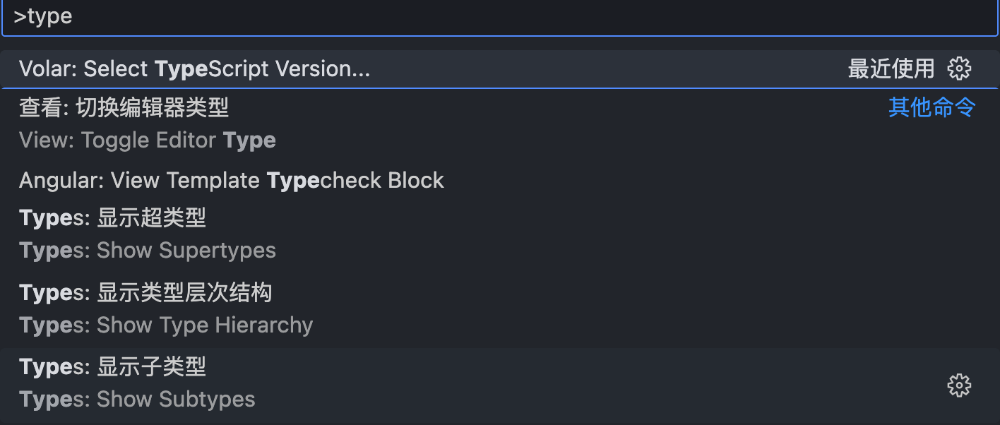
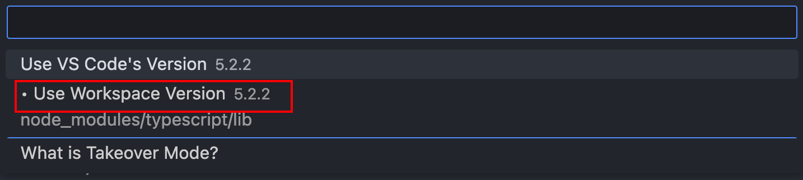

# 2023

## GT Part

## w

=d2-1017=

### vite + vue3 + ts 的项目报错

#### vue 文件导入的 vue 依赖出现红色波浪线

**简述：**

```vue
import { getCurrentInstance } from "vue";
```

vue 文件导入的 vue 依赖出现红色波浪线

**方法：**

把 tsconfig.json 配置项 moduleResolution："bundler"改为 moduleResolution："node"就可以了

```json
{
  "compilerOptions": {
    "moduleResolution": "node"
    // 其他配置
  }
}
```

#### 找不到名称 \_\_dirname

**简述：**  
vite.config.ts 使用\_\_dirname,\_\_dirname 出现红色波浪线

**方法：**  
下载 node 类型声明依赖

> npm install @types/node -D

#### 导入组件出现红色波浪线

**简述：**  
报错消息

```cmd
Cannot find module ... or its corresponding type declarations.（ts2307）
```

**方法：**  
从开发工具和项目配置两个方面解决

##### 优先查看自己 vscode 的工作的 ts 位置及版本

首先，mac: command + shift + P （windows 应该也是类似案件 command 换成 Alt 或者 Ctrl）打开搜索 type 就会显示如下：


点击 volar 选择版本

设置后需要重启 vscode

##### 项目配置

tsconfig.json 增加以下内容

```json
{
  "compilerOptions": {
    "baseUrl": "./",
    "paths": {
      "@/*": ["./src/*"]
    }
    // 其他配置
  }
}
```

vite.config.ts 增加以下内容

```ts
  resolve: {
    alias: {
      '@': path.resolve(__dirname, '/src')
    }
  }
```

#### 导入组件提示：Module xx has no default export

**原因：**  
组件使用了setup语法糖  
Vetur(v0.35.0) 暂不支持ts

**方法：**  
1. 更换支持ts的语法高亮插件 Volar 以取代 Vetur  
2. 不使用setup语法糖