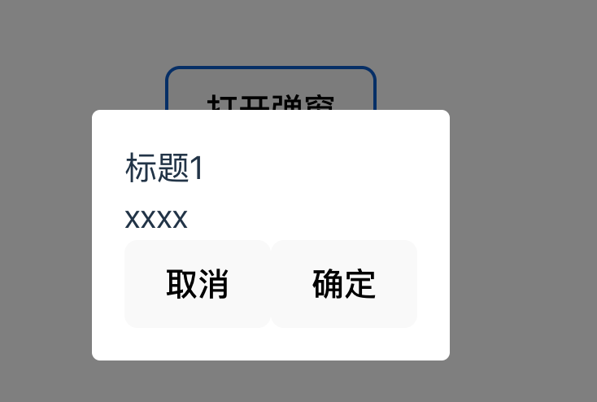
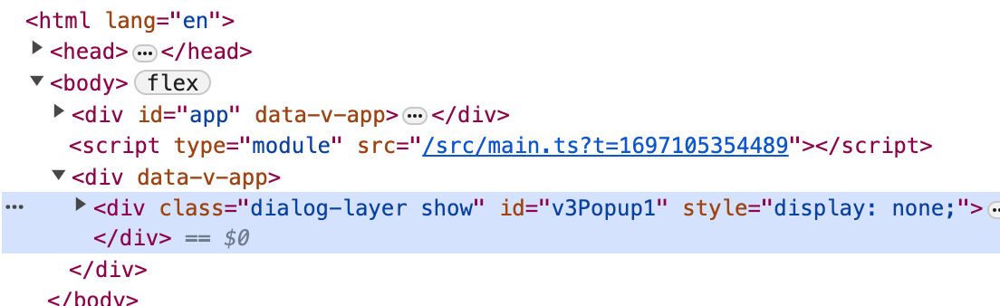

# 2021

## w

=d7--0207=

### 提供，注入

provide, inject  
适用深度嵌套的组件  
父组件使用 provider 提供数据  
子组件使用 inject 使用数据

_provide inject 需要写在 setup 中_

提供非组件内的数据(一般是静态字符串或数字)  
父组件

```js
import { provide } from "vue";
export default {
  setup() {
    provide("number", 1);
  },
};
```

子组件

```js
import { inject } from "vue";
export default {
  setup() {
    const number = inject("number");
    return {
      number,
    };
  },
};
```

提供组件内响应式的数据  
父组件

```js
import { provide, ref } from "vue";
export default {
  setup() {
    const number = ref(1);
    provide("number", number);
    return {
      number,
    };
  },
};
```

子组件

```js
import { inject } from "vue";
export default {
  setup() {
    const number = inject("number");
    return {
      number,
    };
  },
};
```

_provide 还可以提供方法 子组件通过 inject 使用该方法_

单元测试库 Jest Mocha  
端到端测试 Cypress.io

## w

=d3--1013=

### vue3 定义全局变量

```js
import Vue from "vue";
const app = Vue.createApp({});
app.config.globalProperties.$http = () => {};
```

使用全局变量

```js
import { getCurrentInstance } from "vue";
let instance = getCurrentInstance();
let _this = instance.appContext.config.globalProperties;
```

## w

=d4--1012=

### 实现全局弹窗组件

**简述：**

模仿 element-plus 的消息提示，实现弹窗的函数式组件

- 首先实现弹窗组件
  > src/components/dialog.vue

```vue
<template>
  <div class="dialog-layer show" v-show="visible">
    <div class="dialog-box">
      <div class="dialog-body">
        <div>{{ title }}</div>
        <div>{{ content }}</div>
      </div>
      <div class="dialog-btn">
        <button @click="cancelFn">{{ cancelText }}</button>
        <button @click="okFn">{{ okText }}</button>
      </div>
    </div>
  </div>
</template>

<script setup lang="ts">
import { defineProps, ref， watch } from "vue";
const props = defineProps({
  title: {
    type: String,
    default: "提示",
  },
  content: {
    type: String,
    default: "",
  },
  cancelText: {
    type: String,
    default: "取消",
  },
  okText: {
    type: String,
    default: "确定",
  },
  onCancel: {
    type: Function,
  },
  onOk: {
    type: Function,
  },
  visible: {
    type: Boolean,
    default: false
  }
});
watch(() => props.visible, (nVal: any) => {
  visible.value = nVal
})
const visible = ref(true);
const cancelFn = () => {
  visible.value = false;
  props.onCancel && props.onCancel();
};
const okFn = () => {
  props.onOk && props.onOk();
  visible.value = false;
};
</script>

<style>
.dialog-layer {
  position: fixed;
  background: rgba(0, 0, 0, 0.5);
  left: 0;
  top: 0;
  height: 100%;
  width: 100%;
  .dialog-box {
    position: absolute;
    left: 50%;
    top: 50%;
    transform: translate(-50%);
    background: #fff;
    border-radius: 5px;
    padding: 20px;
  }
  .dialog-btn {
    display: flex;
    justify-content: space-between;
    align-items: center;
  }
}
</style>
```

- 实现组件的挂载  
   组件通过 createApp 生成组件实例，挂载 body 上，每次打开都会清除上次的元素
  导出的 V3Popup 实现声明全局弹窗方法
  > src/utils/dialog/ts

```ts
import { createApp } from "vue";
import Dialog from "../components/dialog.vue";
// 单例模式
let mountNode: any;
/**
 * 每次都要删除元素再添加元素并实例化
 */
let createMount = (opts: any) => {
  if (mountNode) {
    document.body.removeChild(mountNode);
    mountNode = null;
  }
  mountNode = document.createElement("div");
  document.body.appendChild(mountNode);
  const app = createApp(Dialog, {
    ...opts,
    visible: true,
    remove() {
      app.unmount();
      document.body.removeChild(mountNode);
    },
  });
  return app.mount(mountNode);
};

function V3Popup(opts: any = {}) {
  opts.id = opts.id ?? "v3Popup" + 1;
  let mount = createMount(opts);
  return mount;
}

V3Popup.install = (app: any) => {
  // app.component("v3-popup", Dialog);
  app.config.globalProperties.$dialog = V3Popup;
};
export default V3Popup;
```

- 在 main.ts 上安装 dialog.ts

```ts
import { createApp } from "vue";
import "./style.css";
import App from "./App.vue";
import Dialog from "./utils/dialog";

createApp(App).use(Dialog).mount("#app");
```

- 在页面上使用

```vue
<script setup>
const { proxy }: any = getCurrentInstance();

const openDialog = () => {
  proxy.$dialog({
    title: "标题",
    content: "xxxx",
    onOk() {
      console.log("test-flag", flag);
    },
  });
};
</script>
<template>
  <button @click="openDialog">打开弹窗</button>
</template>
```

- 实现效果



**总结：**  
目前还没有实现后续可以丰富的功能

- 打开多个弹窗
- content 支持 tsx 方式书写
